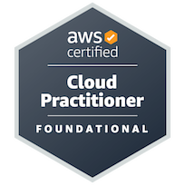
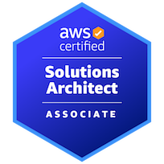
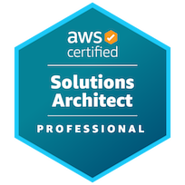
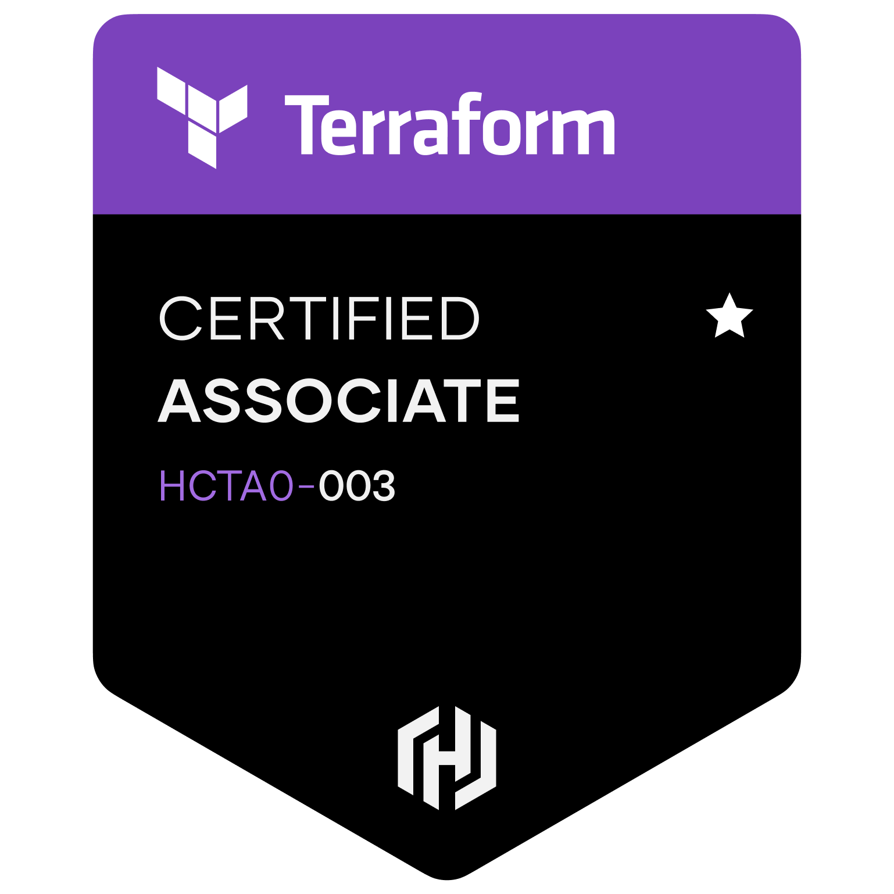

### Hi there 👋

I am currently working as a Cloud Engineer and am into: IAC, Automation, Pipelines and Coding in general!

---

#### Skills

  

**Specializations:** IaC • Automation • CI/CD Pipelines • Cloud Governance & Networking

---

#### Certification/Badges

---

---

<!--
**GrahamOHagan/GrahamOHagan** is a ✨ _special_ ✨ repository because its `README.md` (this file) appears on your GitHub profile.

Here are some ideas to get you started:

- 🔭 I’m currently working on ...
- 🌱 I’m currently learning ...
- 👯 I’m looking to collaborate on ...
- 🤔 I’m looking for help with ...
- 💬 Ask me about ...
- 📫 How to reach me: ...
- 😄 Pronouns: ...
- ⚡ Fun fact: ...
-->
